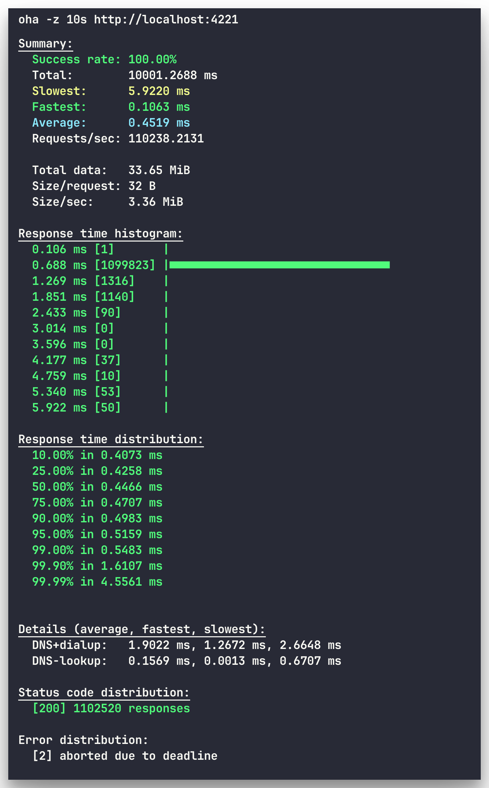

# HTTP/1.1 Server in Rust

A high-performance HTTP server implementation with compression, content negotiation, and file operations.

<div align="center">
  
</div>

Project based on: [CodeCrafters HTTP Protocol Server](https://app.codecrafters.io/courses/http-server/overview)

## Features

- Concurrent client connections
- Persistent HTTP connections (keep-alive) with bidirectional negotiation
- HTTP/1.0 and HTTP/1.1 version support with proper defaults
- HTTP compression (gzip, deflate, brotli) with quality-based negotiation
- Content negotiation (JSON, HTML, plain text)
- File serving with read/write operations
- **Range requests (206 Partial Content)** - Video streaming and partial file downloads
- Dynamic routing with path parameters
- Binary-safe data pipeline

## Quick Start

```bash
# Run server on port 4221
cargo run

# Run with custom file directory
cargo run -- --directory /path/to/files
```

## API Endpoints

| Method | Path | Description |
|--------|------|-------------|
| GET | / | Server welcome message |
| GET | /echo/{text} | Echo service with compression |
| GET | /user-agent | Returns User-Agent header |
| GET | /files/{filename} | Read file (supports range requests) |
| POST | /files/{filename} | Write file |
| GET | /chunked/{text} | Chunked transfer encoding demo |

## Example Usage

```bash
# Basic request
curl http://localhost:4221/

# Echo with compression
curl -H "Accept-Encoding: gzip" http://localhost:4221/echo/hello

# Content negotiation
curl -H "Accept: application/json" http://localhost:4221/echo/test

# User-Agent endpoint
curl -H "User-Agent: myclient/1.0" http://localhost:4221/user-agent

# File operations
curl http://localhost:4221/files/test.txt
curl -X POST -d "content" http://localhost:4221/files/new.txt

# Range requests (partial content)
curl -H "Range: bytes=0-999" http://localhost:4221/files/video.mp4
curl -H "Range: bytes=1000-" http://localhost:4221/files/video.mp4

# Persistent connections (multiple requests on same connection)
curl --http1.1 http://localhost:4221/echo/first --next http://localhost:4221/echo/second

# Force connection close
curl --http1.1 -H "Connection: close" http://localhost:4221/

# Chunked transfer encoding (HTTP/1.1)
curl --http1.1 http://localhost:4221/chunked/streaming-data
curl --http1.1 -v http://localhost:4221/chunked/test  # -v shows Transfer-Encoding: chunked header
```

## File Serving Notes
- Root directory: set via `--directory <path>`. If omitted or invalid, the server falls back to an internal default; missing roots will cause file routes to return 404.
- Resolution: file paths are resolved by joining the configured root with `{filename}`. If the joined path doesn’t exist or can’t be read, the server returns 404.
- Caveat: path normalization is not yet enforced. Avoid `..` segments or untrusted filenames until traversal hardening is added.

## TODO: HTTP/1.1 Features

### Required for Full Compliance
- [x] **Chunked Transfer Encoding** - Stream responses without knowing Content-Length
- [ ] **Host Header Validation** - Require and validate Host header (HTTP/1.1 mandatory)

### Performance & Caching
- [x] **Range Requests** - Partial content delivery (206 status)
- [ ] **Caching Headers** - ETag, If-None-Match, Cache-Control
- [ ] **Conditional Requests** - 304 Not Modified responses
- [ ] **Last-Modified/If-Modified-Since** - Time-based caching

### Additional Methods
- [ ] **HEAD** - Retrieve headers without body
- [ ] **PUT** - Full resource updates
- [ ] **DELETE** - Resource deletion
- [ ] **OPTIONS** - CORS preflight support
- [ ] **PATCH** - Partial resource updates

### Connection Management
- [ ] **Connection Timeouts** - Idle connection cleanup
- [ ] **Request Limits** - Max requests per connection
- [ ] **Concurrent Connection Limits** - Resource protection
- [ ] **Request Body Size Limits** - Prevent memory exhaustion

### Advanced Features
- [ ] **Expect: 100-continue** - Large upload negotiation
- [ ] **HTTP Pipelining** - Multiple requests before responses
- [ ] **Multipart Form Data** - File upload support
- [ ] **URL-Encoded Forms** - Form data parsing
- [ ] **Redirect Support** - 3xx status codes
- [ ] **Request URI Length Limits** - 414 URI Too Long

### Future: HTTP/2
- [ ] **Binary Protocol** - Multiplexed streams
- [ ] **Server Push** - Proactive resource sending
- [ ] **Header Compression** - HPACK algorithm
- [ ] **Stream Prioritization** - Resource delivery optimization
